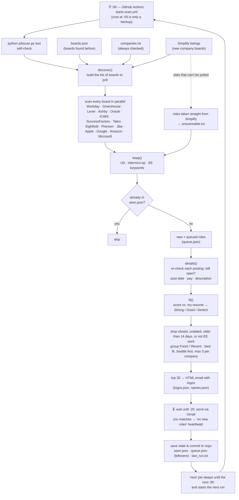

# ee-jobscanner
Scans thousands of companies and lists which ones have new roles listed along with my matching score to each role listed based on my resume and experience.

Every hour, GitHub runs `jobscan.py` on its own servers: the scan starts at :00, the alert email arrives at :20. It checks ~4,900 company career sites (Workday, Greenhouse, Lever, Ashby, Oracle, iCIMS, SuccessFactors, Taleo, Eightfold, Phenom, Jibe, plus Apple, Google, Amazon, Microsoft) for undergrad EE internships. Before sending, every role is checked again: new to you, still open (not filled or expired), actually EE work, and posted by the company within the last 14 days. Roles with no post date are never sent. New matches are emailed in batches of up to 30, best fit first, Seattle first, at most 3 per company. Hours with nothing new still send a short "no new roles" email, so a missing alert means something broke. Nothing runs on your computer.

## How it works



## Set it up from scratch

You need a GitHub account, a Gmail account to send the alerts from, and a Mac or PC with `git` installed.

### 1. Make a Gmail app password (for the sending account)
Google won't let scripts sign in with a normal password.
1. Sign in to the sending Gmail account and turn on **2-Step Verification**: myaccount.google.com/security
2. Go to myaccount.google.com/apppasswords, name it `jobscan`, and click **Create**.
3. Copy the 16-letter code. Remove the spaces. Keep it private and never paste it into chat or code.

### 2. Create the GitHub repo
1. Go to github.com/new, name it (e.g. `ee-jobscanner`), and choose **Public**.
   Public is required for free: a full scan takes ~12 minutes each hour, which is more than private repos get for free.
2. Create a token for uploading: github.com/settings/tokens/new?scopes=repo,workflow
   Give it a note and an expiration, click **Generate token**, and copy it (it starts with `ghp_`).

### 3. Upload the code
In Terminal, from the project folder:
```
cd ~/ee-jobscan
git remote add origin https://github.com/YOUR-USERNAME/ee-jobscanner.git
git pull --rebase origin main        # only if you created the repo with a README
git push -u origin main
```
When it asks, enter your GitHub username and paste the token as the password. Your Mac remembers it after that.

### 4. Add the three secrets
In the repo go to **Settings → Secrets and variables → Actions → New repository secret** and add:

| Name | Value |
|---|---|
| `JOBSCAN_FROM` | the sending Gmail address |
| `JOBSCAN_TO` | the address that receives the alerts |
| `JOBSCAN_PASS` | the 16-letter app password from step 1, no spaces |

They must be **Repository secrets**, not Environment secrets.

### 5. Start it
Go to **Actions → scan → Run workflow**. The first run sends its alert at the next :20 (or as soon as its ~12–15 minute scan finishes, if that's later). After that each run starts the next one at :00, so it keeps going by itself.

## Day to day

- **Pause or stop:** Actions → scan → **⋯ → Disable workflow**. Enable it again the same way.
- **Restart it:** if a :20 alert doesn't arrive, Actions → scan → **Run workflow** once. If a scan is already running, the new one steps aside instead of doubling up.
- **Add a company:** add its careers link to `companies.txt` (one per line, optional `# Company Name` after it), then commit.
  To check a link first: `python3 jobscan.py try '<link>'`
- **If a run fails:** GitHub emails you. `last_run.txt` shows the last run's result or the email error.
  Nothing is lost: unsent roles go out on the next successful run.
- **Editing on your computer:** run `git pull` first, because every run saves its progress to the repo.

## Files

| File | What it is |
|---|---|
| `jobscan.py` | the scanner, filters, fit scoring and email |
| `CHANGELOG.md` | patch notes |
| `companies.txt` | companies always checked, whether or not they're hiring |
| `.github/workflows/scan.yml` | the hourly cycle (each run starts the next; a cron at :05 is only a backup) |
| `seen.json`, `queue.json` | roles already sent / waiting for the next batch of 30 |
| `boards.json`, `names.json`, `logos.json` | discovered company boards, display names, logo links |
| `unscannable.txt` | companies whose sites can't be scanned (their roles come from Simplify) |
| `last_run.txt` | time and result of the last run |

## Handy commands (run on your computer)
```
python3 jobscan.py test                  # quick self-check
python3 jobscan.py dry                   # full scan, print matches, no email
python3 jobscan.py preview '<link>'      # build the alert for one company into last_email.html
```
